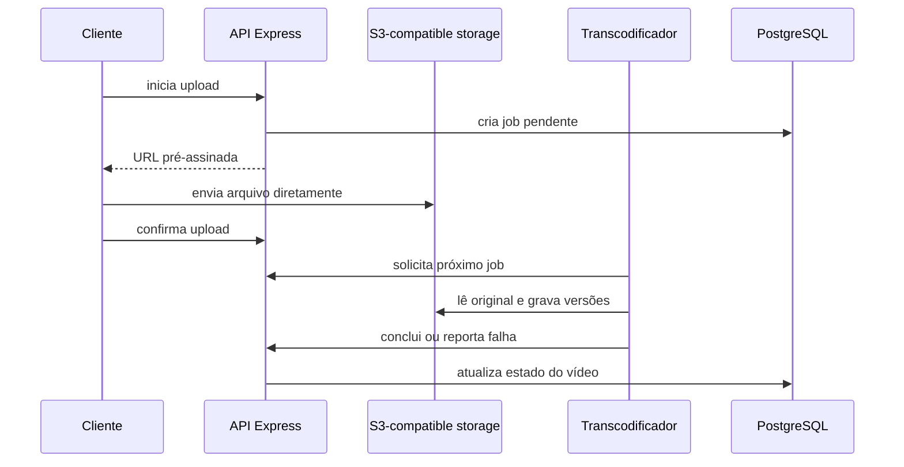

# Video Platform API

> API REST em TypeScript para uma plataforma de compartilhamento de vídeos com
> upload direto para object storage e processamento assíncrono.

Team project built with Express, PostgreSQL, S3-compatible storage, and a separate
transcoding worker. The repository includes an OpenAPI 3 specification.

## Visão geral

A API separa a transferência dos arquivos do tráfego da aplicação. O cliente
solicita uma URL pré-assinada, envia o vídeo diretamente ao armazenamento e
confirma o upload. Um transcodificador autenticado consulta jobs pendentes e
registra a conclusão ou falha do processamento.



## Funcionalidades

- Cadastro, autenticação JWT e atualização de perfil.
- Upload de foto de usuário.
- Iniciação e conclusão de uploads por URLs pré-assinadas.
- Estados de processamento e limpeza de uploads abandonados.
- Busca e listagem de vídeos com acesso autenticado opcional.
- Comentários e curtidas.
- Rotas protegidas por segredo para o transcodificador.
- Validação com Zod e rate limiting no fluxo de upload.
- Especificação OpenAPI e documentação detalhada dos endpoints.

## Stack

| Área | Tecnologias |
|---|---|
| API | Node.js, TypeScript, Express 5 |
| Banco | PostgreSQL, Drizzle ORM |
| Arquivos | AWS SDK, armazenamento compatível com S3 |
| Segurança | JWT, bcrypt, Zod, express-rate-limit |
| Contrato | OpenAPI 3.0 |

## Execução local

Requer Node.js 20+, PostgreSQL e um serviço S3 compatível, como MinIO.

```bash
npm ci
cp .env.example .env
npx drizzle-kit migrate
npm run dev
```

As variáveis necessárias estão documentadas em [`.env.example`](./.env.example):

```text
DATABASE_URL
JWT_SECRET
S3_ENDPOINT
S3_ACCESS_KEY
S3_SECRET_KEY
S3_UPLOADS_BUCKET
S3_VIDEOS_BUCKET
S3_IMAGES_BUCKET
TRANSCODER_SECRET
CORS_ORIGIN
PORT
```

Nunca reutilize os valores de exemplo em um ambiente real.

## Documentação

- [Referência completa da API](./docs/API_DOCUMENTATION.md)
- [Especificação OpenAPI](./docs/openapi.yaml)
- [Fluxo da busca de vídeos](./docs/VIDEO_SEARCH_API.md)

Para visualizar o contrato no Swagger Editor, importe `docs/openapi.yaml` em
[editor.swagger.io](https://editor.swagger.io/).

## Validação disponível

```bash
npm run build
```

O repositório ainda não possui uma suíte de testes automatizados configurada; o
script `npm test` é apenas o placeholder padrão. Essa limitação é mantida explícita
para não apresentar uma garantia de qualidade inexistente.

## Autoria

Projeto acadêmico desenvolvido em equipe por JeanRGW e QuatiKWT. Consulte o
histórico de commits para a atribuição de mudanças específicas.
